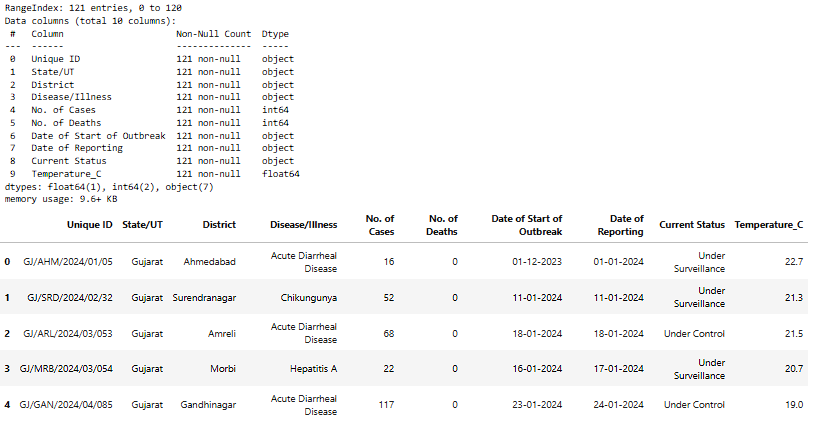

Disease Outbreak Analysis in Gujarat
Study of Trends, Hotspots, Severity, and Environmental Insights

Introduction
Disease outbreaks continue to place a heavy burden on public health systems, especially in regions where geography, climate, and population factors interact. 
This report presents an exploratory analysis of district-level disease outbreak data from Gujarat with the aim of understanding where, when, and how outbreaks occur.
The analysis focuses on:
• Identifying diseases with the highest burden
• Detecting geographic hotspots
• Assessing disease severity
• Understanding seasonal patterns
• Evaluating reporting delays
• Exploring the relationship between temperature and disease incidence
The ultimate goal is to generate actionable insights that can support better surveillance, preparedness, and public health decision-making.
Dataset Overview
The dataset used for this study contains 121 outbreak records from Gujarat extracted from Integrated Disease Surveillance Programme. Each record captures essential information related to disease outbreaks, including:
• Location details such as district and state
• Disease name and current outbreak status
• Number of reported cases and deaths
• Dates marking the start of the outbreak and its reporting
• Associated temperature data

To improve analytical depth, additional features were derived, including outbreak duration, case fatality rate (CFR), and reporting month and year.
Data Preparation and Methodology
Several preprocessing steps were carried out before analysis. Date fields were converted into standard datetime formats, and missing or inconsistent numerical values were carefully handled.
Key epidemiological indicators were calculated:
• Case Fatality Rate (CFR) as deaths per 100 cases
• Outbreak duration as the time between outbreak start and reporting
The data was aggregated at disease, district, and monthly levels. Visualizations were created using Python libraries such as Pandas, Matplotlib, and Seaborn, with a strong emphasis on clarity and interpretability.
Disease Burden Analysis
The analysis shows that disease burden is highly concentrated. A small number of diseases account for the majority of reported cases.
Acute Diarrheal Disease emerges as the most significant contributor, followed by Cholera and Food Poisoning.

However, severity tells a different story. Some diseases with fewer cases exhibit much higher fatality rates.
Acute Encephalitic Syndrome shows the highest average CFR, highlighting that public health risk is not solely driven by case volume.
Geographic Hotspot Analysis
Disease burden is unevenly distributed across districts. Districts such as Kheda, Gandhinagar, and Anand contribute a disproportionately large share of total cases.

These patterns suggest the influence of localized factors such as population density, sanitation infrastructure, environmental conditions, or reporting efficiency. Targeted district-level interventions may therefore be more effective than uniform strategies.
Outbreak Status Assessment
Outbreaks were classified as either “Under Control” or “Under Surveillance.”
Certain diseases show a higher proportion of ongoing surveillance cases, indicating longer outbreak durations or slower containment.

This highlights differences in control effectiveness across diseases and emphasizes the need for disease-specific response strategies.
Temporal Analysis
Monthly trends reveal clear seasonality in disease occurrence. Case counts peak during specific months, suggesting strong links with seasonal factors such as rainfall, temperature, and water quality.

While most outbreaks are reported within a short time frame, a noticeable tail of delayed reporting exists. Such delays can weaken outbreak response and control efforts, underscoring the importance of strengthening surveillance and early detection systems.
Environmental Analysis: Temperature
When focusing on high-burden diseases, clearer patterns emerge between temperature and case counts. A majority of cases cluster within specific temperature ranges.

Temperature distribution analysis shows that most outbreaks occur when temperatures lie between 25°C and 35°C. While this does not imply causation, it suggests a climatic window of elevated risk for disease outbreaks in Gujarat.

Key Insights
• Disease burden is concentrated among a few diseases and districts
• High-fatality diseases require clinical prioritization despite lower case counts
• Seasonal trends play a significant role in outbreak occurrence
• Reporting delays can reduce response effectiveness

• Temperature appears to influence outbreak intensity within certain ranges
Limitations
The analysis is subject to limitations such as potential underreporting, limited dataset size, and the correlational nature of environmental findings. Results should therefore be interpreted cautiously.
Conclusion
This study demonstrates how structured data analysis and visualization can reveal meaningful public health insights. By integrating epidemiological indicators with temporal, geographic, and environmental perspectives, the analysis supports more informed disease surveillance and response planning.
Tools Used
Python, Pandas, Matplotlib, Seaborn

